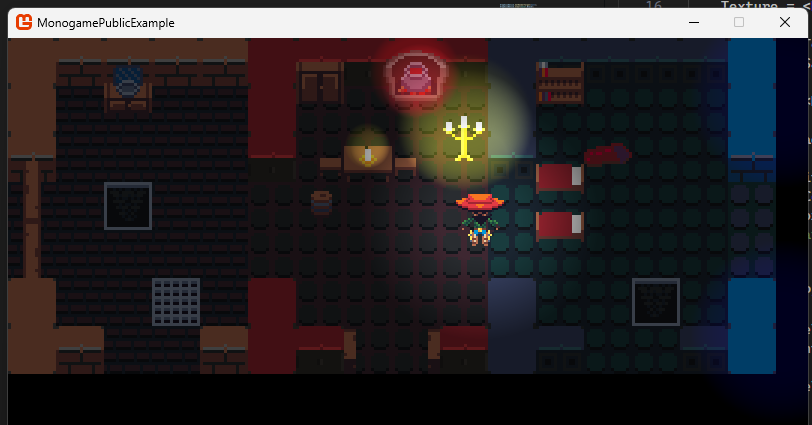

# MonogamePublicExample
 Monogame Examples for sharing

 ## 2d Pixel Shaded Light Sample  (Game2DPixelShadedLightImage)

Code is predominantly in :
 * Game2DPixelShadedLightImage.cs
 * Content\FX\LightShader.fx
 * Content\FX\MaskShader.fx
 * Content\png (for the spritesheets)

I'm not a pro and this probably isn't the best way, but it's a way i figured out how to make it work.  😅
If i was to use this example, at the very least, i would apply bloom. Which i did not do here, because it would become more complex.

